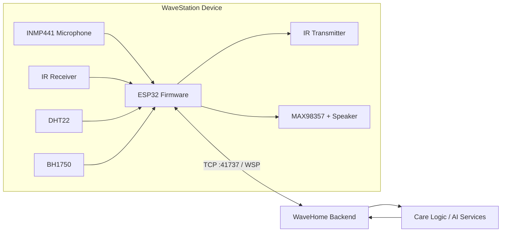
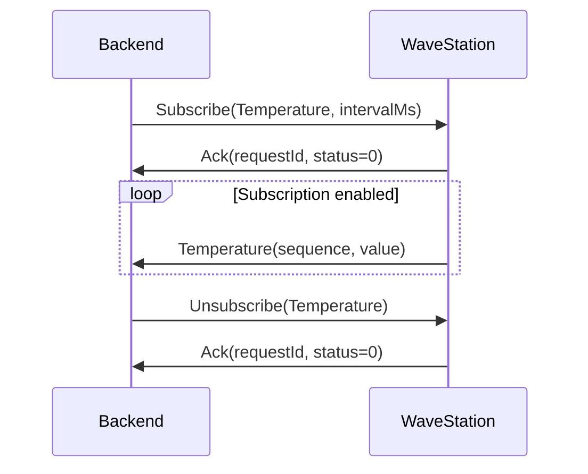

# WaveStation

> ESP32 기반 멀티모달 스마트홈 엣지 게이트웨이  
> 마이크·스피커·IR·환경 센서를 하나의 장치에 통합하고, 자체 설계한 **WSP(WaveStation Protocol)** 로 WaveHome 백엔드와 실시간 데이터를 주고받습니다.

WaveStation은 단순히 여러 센서를 ESP32에 연결한 장치가 아닙니다. 실시간 오디오 수집과 압축, 양방향 장치 제어, TCP 스트림 파싱, 구독 기반 데이터 전송, 오류 응답, 연결 복구까지 직접 설계한 **펌웨어·통신 미들웨어·테스트 백엔드 통합 프로젝트**입니다.

WaveHome 전체 시스템에서는 실제 공간의 데이터를 수집하고 제어 명령을 실행하는 디바이스 계층을 담당합니다. 이를 통해 **디바이스 → 엣지 펌웨어 → 네트워크 프로토콜 → 백엔드 → AI 서비스**로 이어지는 End-to-End 사용자 케어 시스템의 핵심 연결 지점을 구현했습니다.

---

## 핵심 구현 내용

| 영역 | 구현 내용 |
|---|---|
| Embedded Firmware | ESP32 기반 펌웨어, Wi-Fi 연결, 장치 초기화 및 세션 관리 |
| Audio Input/Output | INMP441 I2S 마이크 입력, MAX98357 I2S 스피커 출력 |
| Real-time Audio | 16 kHz·mono·16-bit PCM을 20 ms 프레임으로 실시간 스트리밍 |
| Audio Compression | ESP32 내부 Opus 인코딩·디코딩, 16 kbps 음성 스트림 전송 |
| Infrared | 리모컨 raw timing 수신 및 38 kHz 기반 IR 재송신 |
| Environment Sensors | DHT22 온도·습도, BH1750 조도 센서 연동 |
| Network | ESP32 TCP 서버, 부분 송신 재시도, TCP 스트림 누적 파싱 |
| WSP Protocol | 16-byte 바이너리 헤더, 데이터 타입, sequence, requestId 설계 |
| Control Messages | Subscribe, Unsubscribe, Heartbeat, Ack, Error 처리 |
| Error Handling | 미지원 기능, 잘못된 payload, 장치 준비 실패, 재생 실패 응답 |
| Execution Structure | 확장된 Arduino `loopTask` 안에서 기능별 비차단 폴링 루틴과 드라이버 모듈 분리 |
| Reliability | 스택 오버플로, 연결 종료·재연결, I2S 채널 문제, 라이브러리 충돌 디버깅 |
| Test Backend | 펌웨어와 함께 Python WSP 테스트 클라이언트 및 오디오 분석 도구 개발 |
| Enclosure | 센서 배치와 설치 환경을 고려한 OpenSCAD 케이스 및 STL 제작 |

### 이 프로젝트에서 특히 강조한 부분

- 단순 센서 연결보다 **직접 설계한 소프트웨어 구조와 문제 해결 과정**에 집중했습니다.
- 실시간 오디오가 프레임 단위로 끊기지 않도록 I2S 수집, 압축, TCP 송신 흐름을 연결했습니다.
- 제한된 ESP32 메모리와 스택을 고려해 큰 버퍼는 정적으로 관리하고 `loopTask` 스택을 **49,152 bytes**로 확장했습니다.
- TCP 위에서 사용할 바이너리 패킷의 헤더, 명령, 응답, 순서 번호 구조를 직접 정의했습니다.
- 장치가 지원하지 않거나 준비되지 않은 명령에는 `ErrorUnsupported` 등의 오류를 반환합니다.
- 연결이 종료되면 세션 상태와 sequence를 초기화하고 다음 백엔드 연결을 받을 수 있도록 구성했습니다.
- 실제 펌웨어와 동일한 프로토콜을 사용하는 Python 테스트 백엔드를 함께 만들어 기능을 독립적으로 검증했습니다.

---

## WaveHome에서의 역할

WaveHome은 수면 상태, 자세, 실내 환경 등을 종합적으로 관리하는 사용자 케어 스마트홈 시스템입니다. WaveStation은 그중 물리 환경과 서버를 연결하는 엣지 게이트웨이입니다.



### 수집 방향

- 마이크 → PCM 또는 Opus → WaveHome 백엔드
- IR 수신기 → raw timing → WaveHome 백엔드
- BH1750 → 조도(lux) → WaveHome 백엔드
- DHT22 → 온도(°C)·습도(%) → WaveHome 백엔드

### 제어 방향

- WaveHome 백엔드 → IR raw timing → 기존 에어컨·가전 제어
- WaveHome 백엔드 → PCM 또는 Opus → 스피커 안내·알림 출력

이 저장소는 AI 분석 모델 자체보다 **디바이스 및 게이트웨이 계층**에 집중합니다. WaveHome 백엔드·AI 서비스와 결합하면 센서 입력부터 사용자 케어 동작까지 이어지는 End-to-End 시스템을 구성할 수 있습니다.

---

## 시스템 구성

```text
Sensors / Audio / IR
        ↓
ESP32 Hardware Drivers
        ↓
Feature Polling Routines
        ↓
WSP Packet Builder / Parser
        ↓
TCP Server :41737
        ↕
Python Test Backend or WaveHome Backend
```

### TCP 역할

| 구성 요소 | 역할 |
|---|---|
| ESP32 | TCP 서버, `41737` 포트에서 연결 대기 |
| Python/WaveHome 백엔드 | TCP 클라이언트, ESP32 LAN IP로 연결 |

ESP32는 한 번에 하나의 백엔드 연결을 처리합니다. 연결된 클라이언트에는 `TCP_NODELAY`를 적용해 작은 오디오 프레임의 지연을 줄입니다.

---

## 펌웨어 실행 구조

### 실제 실행 모델

ESP32 Arduino Core는 `setup()`과 `loop()`를 실행하는 FreeRTOS `loopTask`를 생성합니다. WaveStation은 Opus 인코더·디코더와 오디오 처리 과정에서 발생한 스택 오버플로를 해결하기 위해 해당 Task의 스택 크기를 **49,152 bytes**로 확장했습니다.

`appLoop()`에서는 다음 루틴을 짧게 반복합니다.

| 실행 루틴 | 책임 |
|---|---|
| TCP 수신 루틴 | 스트림 데이터 누적, WSP 패킷 경계 복원, 명령 dispatch |
| IR 수신 루틴 | 구독 상태일 때 리모컨 raw timing 확인 및 전송 |
| 센서 루틴 | 구독 주기와 변화량 조건을 확인해 환경 데이터 전송 |
| 마이크 루틴 | 20 ms PCM 프레임 수집, PCM/Opus 패킷 송신 |

기능별 로직은 다음 모듈로 분리되어 있습니다.

| 모듈 | 역할 |
|---|---|
| `app.cpp` | Wi-Fi, TCP 세션, 구독 상태, WSP 수신 dispatch, 기능 폴링 |
| `wave_station.h` | WSP 상수, 타입, 헤더와 payload 구조 정의 |
| `wsp_packet.*` | Ack/Error/Heartbeat 및 데이터 패킷 생성·송신 |
| `i2s_mic.*` | INMP441 I2S 입력과 PCM 변환 |
| `opus_codec.*` | MicComp 인코딩과 SpkComp 디코딩 |
| `ir_driver.*` | IR raw timing 수신·송신 |
| `sensor_driver.*` | DHT22·BH1750 초기화와 측정 |
| `speaker_driver.*` | MAX98357 I2S 출력 |

이 구조는 기능 책임을 분리하면서도, 별도 Task 간 Queue와 동기화 비용을 추가하지 않고 현재 규모의 기능을 하나의 실행 흐름에서 관리하도록 설계한 것입니다.

---

## WSP: WaveStation Protocol

WSP는 WaveStation과 백엔드가 오디오, IR, 센서, 제어 메시지를 동일한 형식으로 교환하기 위해 설계한 바이너리 프로토콜입니다.

### 기본 규격

| 항목 | 값 |
|---|---:|
| Protocol identifier | `0x57535031` |
| Version | `1` |
| Byte order | Little-endian |
| Header size | `16 bytes` |
| Maximum payload | `4,096 bytes` |
| TCP receive buffer | `8,192 bytes` |
| TCP port | `41737` |

모든 메시지는 고정 헤더와 가변 payload로 구성됩니다.

```text
16-byte Header | payloadSize bytes
```

### 헤더 분리

| 헤더 | 마지막 4-byte 필드 | 용도 |
|---|---|---|
| ControlHeader | `requestId` | Subscribe, Unsubscribe, Ack, Error, Heartbeat |
| DataHeader | `sequence` | PCM, Opus, IR, 센서 데이터 |

- `requestId`는 요청과 Ack/Error 응답을 연결합니다.
- `sequence`는 타입별 데이터 순서와 누락을 확인하는 데 사용합니다.
- 두 헤더는 모두 16 bytes이며 공통 앞부분을 사용합니다.

### 지원 메시지 타입

| Type | 값 | 방향 | 용도 |
|---|---:|---|---|
| MicPCM | `0x0101` | Device → Host | 원본 PCM 마이크 스트림 |
| MicComp | `0x0102` | Device → Host | Opus 압축 마이크 스트림 |
| SpkPCM | `0x0111` | Host → Device | PCM 스피커 재생 |
| SpkComp | `0x0112` | Host → Device | Opus 스피커 재생 |
| IrReceive | `0x0201` | Device → Host | IR raw timing 수신 결과 |
| IrTransmit | `0x0202` | Host → Device | IR raw timing 송신 명령 |
| AmbientLight | `0x0301` | Device → Host | 조도 |
| Temperature | `0x0302` | Device → Host | 온도 |
| Humidity | `0x0303` | Device → Host | 습도 |
| Subscribe | `0xF001` | Host → Device | 데이터 전송 시작 |
| Unsubscribe | `0xF002` | Host → Device | 데이터 전송 중지 |
| Ack | `0xF010` | Both | 요청 성공 응답 |
| Error | `0xF011` | Both | 요청 실패 응답 |
| Heartbeat | `0xF020` | Both | 연결 생존 확인 |

### Subscribe / Unsubscribe

백엔드는 필요한 데이터만 구독할 수 있습니다.



구독 가능한 타입은 다음과 같습니다.

- MicPCM
- MicComp
- IrReceive
- AmbientLight
- Temperature
- Humidity

`SpkPCM`, `SpkComp`, `IrTransmit`은 구독 스트림이 아니라 백엔드가 필요할 때 보내는 일회성 Data 패킷입니다.

### Heartbeat

백엔드가 Heartbeat를 보내면 ESP32는 동일한 `requestId`로 Heartbeat를 반환합니다. Python 테스트 백엔드의 기본 주기는 **5초**이며 `0`으로 설정하면 비활성화할 수 있습니다.

### Ack와 Error

지원되는 Subscribe/Unsubscribe 요청이 정상 처리되면 `Ack(status=0)`를 반환합니다. 다음 상황에서는 Error 패킷을 반환합니다.

| 오류 코드 | 값 | 예시 |
|---|---:|---|
| ErrorUnsupported | `-1` | 미지원 타입, Opus/스피커/센서 준비 실패, 지원하지 않는 오디오 형식 |
| ErrorBusy | `-2` | 스피커 재생 실패 |
| ErrorInvalidPayload | `-3` | 잘못된 길이, 크기, sample count, IR raw 구조 |

오류 메시지는 최대 **96 bytes**까지 함께 전송합니다.

### TCP 스트림 파싱

TCP의 한 번의 `read()`는 WSP 패킷 하나와 일치하지 않을 수 있습니다. WaveStation은 수신 데이터를 **8 KB 버퍼**에 누적한 뒤 다음 조건을 확인합니다.

1. 16-byte 헤더가 모두 수신되었는지 확인
2. protocol identifier와 version 검증
3. payload가 4,096 bytes 이하인지 검증
4. 헤더와 payload 전체가 모일 때까지 대기
5. 완성된 패킷만 dispatch
6. 남은 바이트를 버퍼 앞으로 이동

잘못된 identifier/version, 과도한 payload, 수신 버퍼 overflow가 발생하면 연결을 종료해 파서 상태가 오염되는 것을 방지합니다.

### 송신 안정성

`WiFiClient.write()`가 전체 패킷을 한 번에 처리한다고 가정하지 않습니다. 실제 전송된 길이를 누적하며 남은 바이트를 계속 전송하고, 송신 버퍼가 잠시 가득 찬 경우 최대 **1초** 동안 재시도합니다.

---

## 실시간 오디오

### 마이크 입력

INMP441의 I2S 32-bit 슬롯에서 유효 샘플을 읽어 signed 16-bit PCM으로 변환합니다.

| 항목 | 값 |
|---|---:|
| Sample rate | `16,000 Hz` |
| Channels | `1 (mono)` |
| Bits per sample | `16-bit` |
| Frame duration | `20 ms` |
| Samples per frame | `320` |
| PCM bytes per frame | `640 bytes` |
| Frames per second | 약 `50` |
| Raw PCM bandwidth | 약 `32 KB/s` |
| WSP MicPCM packet size | `664 bytes` |

### I2S 슬롯 자동 선택

INMP441의 L/R 핀 설정과 ESP32 I2S 채널 해석이 맞지 않으면 한쪽 슬롯에서 거의 0인 값만 수집될 수 있습니다. 현재 드라이버는 left/right 슬롯을 모두 읽고 프레임별 절대 에너지를 비교해 실제 신호가 있는 슬롯을 자동 선택합니다.

이 처리는 다음과 같은 무음 문제를 해결하기 위해 추가했습니다.

- 녹음 파일은 생성되지만 대부분 0에 가까운 값
- 최댓값이 0이고 특정 음수 값만 반복
- `zero_ratio`가 0.99 이상으로 측정됨

### PCM 실시간 스트리밍

MicPCM을 구독하면 20 ms마다 320 samples를 수집해 WSP 패킷으로 전송합니다. `TCP_NODELAY`, 부분 송신 반복, 타입별 sequence를 적용해 작은 오디오 프레임을 연속적으로 처리합니다.

### Opus 압축

MicComp를 구독하면 동일한 PCM 프레임을 ESP32에서 Opus로 압축해 전송합니다.

| 항목 | 값 |
|---|---:|
| Codec | Opus |
| Application | VOIP |
| Target bitrate | `16 kbps` |
| Complexity | `0` |
| VBR | 비활성화 |
| Signal hint | Voice |
| Maximum encoded buffer | `512 bytes` |

연산량과 스택 사용량을 줄이기 위해 낮은 complexity를 사용합니다. Opus encoder가 초기화되지 않은 경우 MicComp 구독을 승인하지 않고 `ErrorUnsupported`를 반환합니다.

### 스피커 출력

백엔드는 PCM 또는 Opus 프레임을 WaveStation으로 보낼 수 있습니다.

- SpkPCM: 16 kHz·mono·16-bit PCM 재생
- SpkComp: Opus 디코딩 후 PCM 재생
- 최대 decoded frame: `960 samples`, 16 kHz 기준 `60 ms`
- mono 샘플을 I2S left/right 슬롯에 복제해 MAX98357 채널 설정에 따른 무음을 방지
- KeyFrame flag가 설정된 SpkComp 패킷에서는 Opus decoder 상태 초기화

---

## IR 송수신

### IR 수신

IRremoteESP8266 라이브러리를 사용해 리모컨 신호를 microsecond 단위 raw timing 배열로 수집합니다.

- 수신 핀: GPIO27
- 수신 및 전송 상한: 최대 `512` timing values
- timeout: `50 ms`
- 첫 leading gap을 제외하고 mark부터 전송
- 라이브러리 overflow 또는 길이 제한 발생 시 `overflow=1`
- 각 timing 값은 `uint16_t` 범위로 제한

IR 수신 드라이버, WSP 송신 버퍼, Python 테스트 백엔드의 허용 길이를 모두 512개 raw timing 기준으로 통일했습니다.

### IR 송신

백엔드가 보낸 raw timing을 IR LED로 재생합니다.

- 송신 핀: GPIO26
- 기본 carrier: `38,000 Hz`
- `repeat=0`은 1회, `repeat=N`은 총 `N+1`회 송신
- 반복 송신 사이 대기: `50 ms`

특정 제조사 프로토콜에 종속되지 않고 raw timing을 저장·재생하므로 기존 에어컨과 리모컨 기반 가전을 WaveHome에 연결할 수 있습니다.

---

## 온도·습도·조도 센서

| 데이터 | 센서 | 단위 | 기본/최소 전송 주기 |
|---|---|---|---:|
| AmbientLight | BH1750 | lux | 기본 1,000 ms / 최소 200 ms |
| Temperature | DHT22 | °C | 기본 2,000 ms / 최소 2,000 ms |
| Humidity | DHT22 | % | 기본 2,000 ms / 최소 2,000 ms |

### OnChangeOnly

Subscribe options의 OnChangeOnly flag를 사용하면 값이 충분히 변했을 때만 전송합니다.

| 데이터 | 변화 기준 |
|---|---:|
| 조도 | `1.0 lux` |
| 온도 | `0.2 °C` |
| 습도 | `1.0 %` |

정상 측정값은 `quality=255`, 읽기 실패는 `quality=0`과 값 `0`으로 전송합니다. 이를 통해 서버는 네트워크 연결 상태와 센서 측정 품질을 구분할 수 있습니다.

---

## 연결 종료와 재연결

WaveStation은 연결 상태를 다음과 같이 관리합니다.

1. Wi-Fi가 끊기면 다시 연결을 시도합니다.
2. 백엔드 연결이 없으면 TCP 서버에서 새 클라이언트를 확인합니다.
3. 새 연결이 수립되면 구독 상태, 수신 버퍼, sequence, 센서 변화 감지 상태를 초기화합니다.
4. 송신 실패, 잘못된 헤더, 과도한 payload, 수신 버퍼 overflow가 발생하면 현재 클라이언트를 종료합니다.
5. 이후 다음 백엔드 연결을 다시 받을 수 있습니다.

Python 테스트 백엔드는 서버가 연결을 종료하면 종료 코드와 함께 원인을 출력합니다. 운영 백엔드에서는 재접속 backoff 정책을 추가하는 것을 권장합니다.

---

## 하드웨어

### 사용 부품

| 부품 | 역할 | 인터페이스 |
|---|---|---|
| ESP32 Dev Board | 메인 MCU 및 Wi-Fi/TCP | Wi-Fi, GPIO, I2S, I2C |
| INMP441 | 디지털 마이크 | I2S RX |
| MAX98357 | I2S DAC/Amplifier | I2S TX |
| Speaker | 안내 음성·알림 출력 | MAX98357 |
| IR Receiver | 리모컨 신호 수신 | GPIO |
| IR Transmitter | 가전 제어 | GPIO |
| DHT22 | 온도·습도 | Digital GPIO |
| BH1750 | 조도 | I2C |

### 핀 배치

#### INMP441

| INMP441 | ESP32 |
|---|---|
| VDD | 3.3V |
| GND | GND |
| L/R | 3.3V or GND |
| SCK | GPIO14 |
| WS | GPIO15 |
| SD | GPIO32 |

#### IR

| 모듈 | ESP32 / 전원 |
|---|---|
| IR Receiver OUT | GPIO27 |
| IR Receiver VCC | 3.3V |
| IR Receiver GND | GND |
| IR Transmitter Signal | GPIO26 |
| IR Transmitter VCC | 5V |
| IR Transmitter GND | GND |

#### DHT22

| DHT22 | ESP32 |
|---|---|
| VCC | 3.3V |
| GND | GND |
| DATA | GPIO25 |

#### BH1750

| BH1750 | ESP32 |
|---|---|
| VCC | 3.3V |
| GND | GND |
| SDA | GPIO21 |
| SCL | GPIO22 |
| ADDR | GND |

#### MAX98357

| MAX98357 | ESP32 / 전원 |
|---|---|
| VIN | 5V |
| GND | GND |
| BCLK | GPIO18 |
| LRC | GPIO19 |
| DIN | GPIO23 |

모든 모듈의 GND는 공통으로 연결해야 합니다.

---

## 저장소 구조

```text
wavestation/
├─ README.md
├─ doc/
│  ├─ wave-station-protocol.md
│  └─ wave-station-esp32-guide.md
├─ esp32/
│  ├─ wave_station_firmware.ino
│  ├─ app.cpp
│  ├─ wave_station.h
│  ├─ wsp_packet.h / .cpp
│  ├─ i2s_mic.h / .cpp
│  ├─ opus_codec.h / .cpp
│  ├─ ir_driver.h / .cpp
│  ├─ sensor_driver.h / .cpp
│  ├─ speaker_driver.h / .cpp
│  └─ tools/send_spkpcm_tone.py
├─ test_backend/
│  ├─ wave_station_test_backend.py
│  ├─ check_raw.py
│  ├─ raw_to_wav.py
│  └─ test_scenarios.txt
└─ wavestation_case/
   ├─ wavestation_case.scad
   ├─ wavestation_case_base.stl
   └─ wavestation_case_lid.stl
```

---

## 개발 환경

### Arduino 설정

| 항목 | 설정 |
|---|---|
| Board | ESP32 Dev Module |
| Serial baud rate | 115200 |
| ESP32 Arduino Core | 2.0.17 |

### Arduino 라이브러리

Arduino Library Manager에서 다음 라이브러리를 설치합니다.

- IRremoteESP8266
- esp32_opus
- DHT sensor library
- Adafruit Unified Sensor
- BH1750

### Wi-Fi 설정

`esp32/app.cpp`의 Wi-Fi SSID와 비밀번호 placeholder를 개발 환경에 맞게 변경합니다.

---

## 실행 및 테스트

아래 예시는 ESP32 IP가 `192.168.0.50`이고, 현재 디렉터리가 `test_backend`인 경우입니다.

### 1. Heartbeat 및 기본 연결

```powershell
python wave_station_test_backend.py 192.168.0.50
```

### 2. MicPCM 녹음

```powershell
python wave_station_test_backend.py 192.168.0.50 `
  --subscribe micpcm `
  --pcm-out mic.raw `
  --heartbeat-interval 0
```

예상 raw PCM 크기:

| 녹음 시간 | 파일 크기 |
|---:|---:|
| 1초 | 약 32 KB |
| 3초 | 약 96 KB |
| 5초 | 약 160 KB |
| 10초 | 약 320 KB |

재생:

```powershell
ffplay -f s16le -ar 16000 -ac 1 mic.raw
```

### 3. PCM 통계 확인

```powershell
python check_raw.py
```

정상 음성은 일반적으로 음수와 양수 범위가 모두 나타나며, 말할 때 RMS가 증가합니다. `zero_ratio`가 0.99에 가깝고 최댓값이 0인 경우 I2S 슬롯이나 마이크 배선을 먼저 확인합니다.

### 4. raw를 WAV로 변환

```powershell
python raw_to_wav.py mic.raw mic.wav
```

### 5. MicComp Opus 프레임 저장

```powershell
python wave_station_test_backend.py 192.168.0.50 `
  --subscribe miccomp `
  --opus-out-dir opus_frames `
  --heartbeat-interval 0
```

20 ms 프레임이므로 정상 수신 시 약 50 frames/s가 생성됩니다. `.opusframe`은 정식 Ogg/Opus 파일이 아니라 WSP payload의 Opus encoded data만 저장한 디버그용 raw frame입니다.

### 6. IR 수신

```powershell
python wave_station_test_backend.py 192.168.0.50 `
  --subscribe ir `
  --ir-jsonl ir_raw.jsonl `
  --heartbeat-interval 0
```

`overflow=1`인 신호는 불완전할 수 있으므로 학습 데이터로 사용하지 않는 것이 안전합니다.

### 7. IR 송신

```powershell
python wave_station_test_backend.py 192.168.0.50 `
  --send-ir-raw "9000,4500,560,560,560,1690" `
  --carrier-hz 38000 `
  --repeat 0 `
  --heartbeat-interval 0
```

### 8. 환경 센서

```powershell
python wave_station_test_backend.py 192.168.0.50 `
  --subscribe ambient temperature humidity `
  --sensor-interval-ms 1000 `
  --heartbeat-interval 0
```

DHT22는 펌웨어에서 최소 2,000 ms로 보정되므로 명령에 1,000 ms를 지정해도 실제 온도·습도 전송 주기는 2,000 ms 이상입니다.

### 9. 스피커 사인파 테스트

```powershell
python wave_station_test_backend.py 192.168.0.50 `
  --send-spkpcm-tone `
  --tone-freq 880 `
  --tone-duration 2 `
  --tone-amp 0.15 `
  --heartbeat-interval 0
```

처음 테스트할 때는 낮은 진폭부터 사용합니다.

### 10. WAV 재생

권장 형식은 16 kHz, mono, signed 16-bit PCM입니다.

```powershell
ffmpeg -i input.wav -ar 16000 -ac 1 -sample_fmt s16 test_16k_mono.wav
python wave_station_test_backend.py 192.168.0.50 `
  --send-spkpcm-wav test_16k_mono.wav `
  --heartbeat-interval 0
```

### 11. 저장한 Opus 프레임 재생

```powershell
python wave_station_test_backend.py 192.168.0.50 `
  --send-spkcomp-dir opus_frames `
  --heartbeat-interval 0
```

테스트 백엔드는 Ctrl+C로 종료할 때 활성 구독에 대해 Unsubscribe를 전송합니다.

---

## 주요 문제 해결

### 1. I2S 마이크가 거의 무음으로 수집되는 문제

**증상**

- raw 파일 크기는 정상적으로 증가
- 값 대부분이 0
- 특정 음수 최솟값만 간헐적으로 발생

**원인**

INMP441의 L/R 설정과 ESP32가 읽는 I2S 슬롯이 일치하지 않아 빈 슬롯을 선택하고 있었습니다.

**해결**

- left/right 슬롯을 동시에 수집
- 각 슬롯의 프레임 에너지 계산
- 더 큰 신호가 존재하는 슬롯을 자동 선택
- L/R 배선도 함께 점검

### 2. Opus 사용 시 stack canary / 스택 오버플로

**원인**

Opus encoder·decoder 초기화와 프레임 처리 과정이 기본 Arduino `loopTask` 스택보다 많은 공간을 사용했습니다.

**해결**

- `loopTask` 스택을 49,152 bytes로 확장
- 큰 PCM·Opus 버퍼를 정적 영역에 배치
- Opus complexity를 0으로 설정
- 로그에 free heap을 출력해 런타임 상태 확인

### 3. TCP에서 패킷 경계가 보장되지 않는 문제

**원인**

TCP는 message 단위가 아닌 byte stream이므로 하나의 WSP 패킷이 여러 번 나뉘어 들어오거나 여러 패킷이 한 번에 수신될 수 있습니다.

**해결**

- 8 KB 수신 버퍼에 누적
- 16-byte 헤더와 payloadSize로 전체 길이 계산
- 완성된 패킷만 처리
- 남은 바이트 보존
- identifier/version/payloadSize 오류 시 연결 종료

### 4. 연결 종료 후 이전 구독 상태가 남는 문제

**해결**

새 백엔드가 연결될 때 다음 상태를 초기화합니다.

- Subscribe 상태
- TCP 수신 버퍼
- 타입별 sequence
- 센서 마지막 전송 시각
- OnChangeOnly 비교값

### 5. 미지원 장치와 잘못된 명령 처리

WSP Error 패킷으로 원인을 전달합니다.

- 준비되지 않은 Opus encoder/decoder
- 감지되지 않은 BH1750
- 초기화되지 않은 스피커
- 지원하지 않는 오디오 형식
- 잘못된 payload 길이
- 허용 범위를 벗어난 sample count 또는 IR 길이
- Subscribe 대상이 아닌 타입

---

## 3D 프린팅 케이스

WaveStation의 센서 노출, 음향 입출력, 전원 연결, 벽·헤드보드 설치를 고려해 전용 케이스를 OpenSCAD로 설계했습니다. 본체와 뚜껑은 각각 출력할 수 있으며, 조립 상태도 미리 확인할 수 있도록 모델의 출력 대상을 분리했습니다.

### 기본 치수

| 항목 | 값 |
|---|---:|
| 전체 외형 | 110 × 75 × 약 90 mm |
| 본체 높이 | 82 mm |
| 뚜껑 높이 | 8 mm |
| 벽 두께 | 2.4 mm |
| 바닥 두께 | 3 mm |
| 뚜껑 상판 두께 | 3.2 mm |
| X/Y 방향 전체 결합 여유 | 0.65 mm |
| 한쪽 기준 예상 간격 | 약 0.325 mm |
| 마찰 돌기 두께 | 0.30 mm |

### 센서 및 포트 개구부

모델 좌표는 정면을 `Y=0`, 후면을 `Y=75`, 왼쪽을 `X=0`, 오른쪽을 `X=110`으로 정의했습니다.

| 면 | 대상 | 크기 및 형태 | 중심 위치 또는 범위 |
|---|---|---|---|
| 정면 | I2S 마이크 | Ø15 mm 원형 | X=24, Z=23 mm |
| 정면 | IR 수신부 | 6 × 8 mm 라운드 사각형 | X=55, Z=37 mm |
| 정면 | 스피커 | 23 × 14 mm 캡슐형 | X=84, Z=23 mm |
| 상단 | IR 송신 LED | Ø7.2 mm 원형 | X=25, Y=22 mm |
| 상단 | BH1750 조도 센서 | 5.5 × 3.5 mm 라운드 사각형 | X=82, Y=23 mm |
| 왼쪽 | USB-C 전원 포트 | 17 × 11 mm 라운드 슬롯 | 후면에서 23.5~40.5 mm, 바닥에서 12~23 mm |
| 오른쪽 | 온·습도 센서 | 21 × 16 mm 직사각형 | 중심 Y=54, Z=30 mm |
| 후면 | 벽·헤드보드 고정부 | 2개의 keyhole | X=32·78 mm, 약 Z=31~49 mm |

정면 상단에는 `Wave Station` 텍스트를 양각으로 배치하고, 뚜껑에는 외부 SVG 없이 OpenSCAD 형상만으로 구성한 WaveStation 로고를 양각으로 적용했습니다.

### 뚜껑 결합 구조

뚜껑은 나사나 별도 체결 부품 없이 내부 skirt와 네 면의 마찰 돌기를 이용해 고정하는 friction-fit 구조입니다. `0.65 mm`는 한쪽 여유가 아니라 X축과 Y축 각각의 **전체 결합 여유**이며, 이론상 한쪽 간격은 약 `0.325 mm`입니다. 전·후·좌·우에는 `0.30 mm` 두께의 마찰 돌기를 배치해 흔들림을 줄였습니다.

OpenSCAD의 출력 선택값을 이용해 다음 형태로 렌더링하거나 STL로 내보낼 수 있습니다.

- `assembly`: 본체와 뚜껑의 조립 배치 확인
- `base`: 본체만 출력
- `lid`: 뚜껑만 출력

---

## WaveStation 요약

- ESP32 기반 멀티센서·멀티미디어 펌웨어 개발
- I2S DMA 기반 실시간 마이크 입력 및 스피커 출력
- PCM 프레임 처리와 Opus 압축·복원
- TCP 스트림 기반 바이너리 프로토콜 설계와 구현
- Subscribe/Unsubscribe/Heartbeat/Ack/Error 제어 흐름 설계
- 제한된 임베디드 메모리와 Task 스택을 고려한 버퍼 구조 설계
- 미지원 장치와 잘못된 요청에 대한 명시적 오류 처리
- 연결 종료·재연결 시 세션 상태 복구
- Python 테스트 백엔드와 분석 도구를 활용한 통합 검증
- 하드웨어 배치와 사용 환경을 고려한 3D 케이스 제작

**WaveStation은 디바이스부터 네트워크, 백엔드 테스트 환경까지 직접 구현하고, WaveHome AI 서비스로 연결되는 End-to-End 시스템의 핵심 게이트웨이를 설계한 프로젝트입니다.**

---

## 상세 문서

- `doc/wave-station-protocol.md`: WSP 패킷 필드와 타입 상세 명세
- `doc/wave-station-esp32-guide.md`: ESP32 구현 과정과 설계 참고 문서
